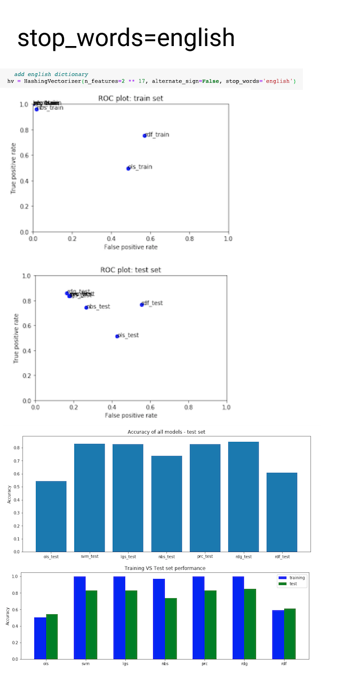

## Base models

Task: *Fit various models and assess their performance on the train and test datasets. Then, introduce changes to the models to show the effect on one or more alterations on feature selection, extraction, and transformation.*

#### Changes Introduced:
* HashingVectorizer
	* stop_words=english
	* n_features= 2 ** 10  
* StandardScaler
	* std=false
* TfidfTransformer
	* sublinear_tf=true

Before introducing any changes, the models performed as follows:

The graphs representing the performance are as follows:
###### stop_words=english 

###### n_features= 2 ** 10

###### std=false

###### sublinear_tf=true
The Naive Bayes model erred, showing that Input X must be non-negative:

For easier comparison, here I show the ROC plots and Accuracy comparison between all iterations:

###### ROC train set

###### ROC test set

###### Accuracy comparison

