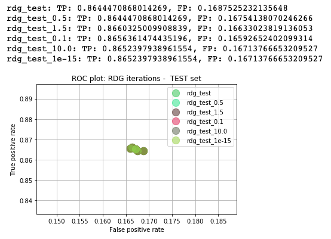

## Regularization parameter - Ridge()

Task: *Introduce changes to the alpha parameter of the Ridge() class to show the effect of multiple alterations on a regularization parameter.*

#### Iterations:
* alpha=0.5
* alpha=1.5
* alpha=0.1
* alpha=10.0
* alpha=1e-15

 

Before introducing any changes, the models performed as follows:

 

Graphs representing the performance of each iteration:
###### alpha=0.5

###### alpha=1.5

###### alpha=0.1

###### alpha=10.0

###### alpha=1e-15

 

For easier comparison, here I show the ROC plots and Accuracy comparison between all iterations:

###### ROC train set

###### ROC test set

###### Accuracy comparison

