## Regularization parameter - SVC()

Task: *Introduce changes to show the effect of multiple alterations on a margin size parameter (C) for the Support Vector Machines classifier (SVC) in scikit-learn.*

Due to the long time required to run the SVC model, other similar models were included in the notebook: Linear SVR and Linear SVC.

#### Iterations:
* Linear SVR
	* default parameters
	* max_iter=1000000 
	* max_iter=1000000000
	* C=0.0001
* Linear SVC
	* default parameters
	* C=100
	* C=1000000
	* C=0.001
	* C=1e-15
	* C=1e-323
* SVC
	* C=1e-15, kernel='linear'
	* C=1e-323, kernel='linear'

All iterations of the Linear SVR resulted in no predictions, and the model was not included in the ROC plots.

 

Before introducing any changes, Linear SVC performed as follows:
###### Linear SVC
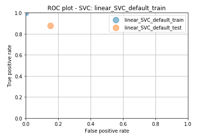

SVC with default parameters did not execute, so only iterations that executed were visualized.

 

Graphs representing the performance:
###### Linear SVC C=100
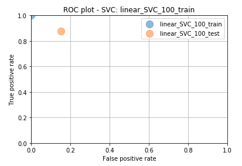
###### Linear SVC C=1000000
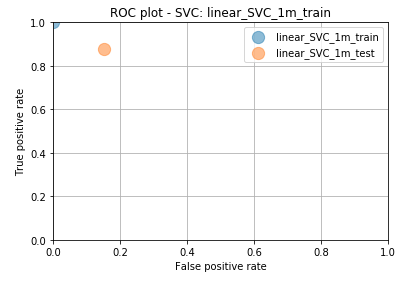
###### Linear SVC C=0.001

###### Linear SVC C=1e-15
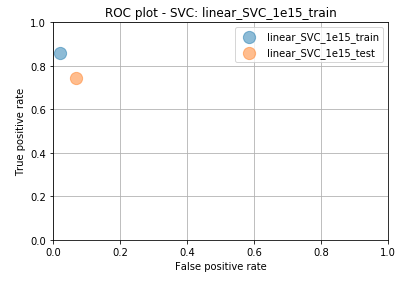
###### Linear SVC C=1e-323
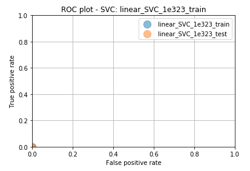
###### SVC C=1e-15
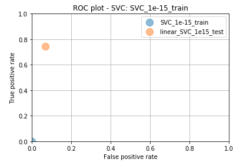
###### SVC C=1e-323
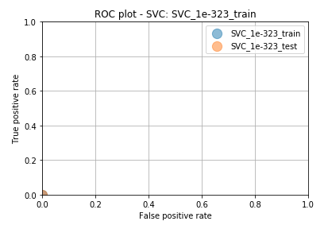

 

For easier comparison, here I show the ROC plots and Accuracy comparison between all iterations:

###### ROC train set
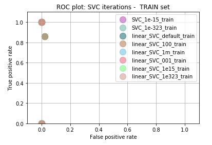
###### ROC test set
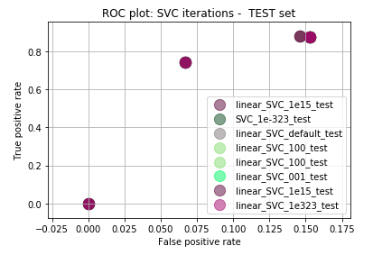
###### Accuracy comparison
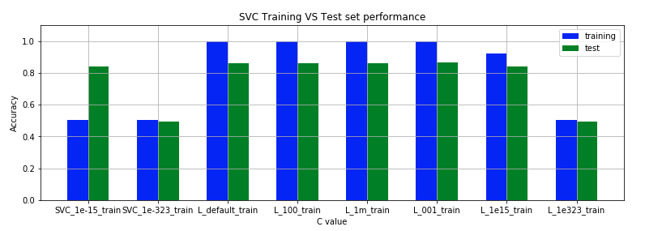
###### Precision comparison
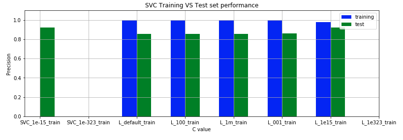

