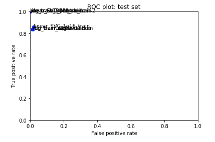
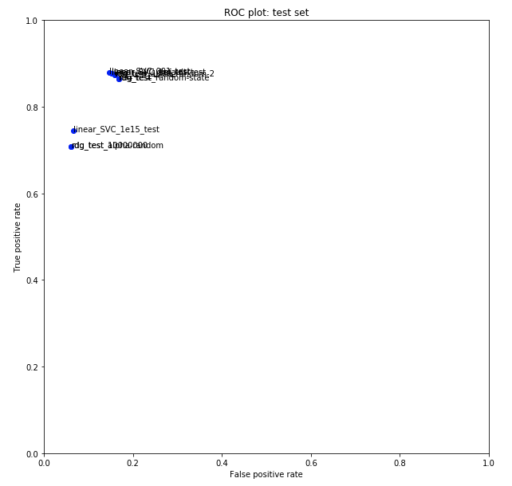
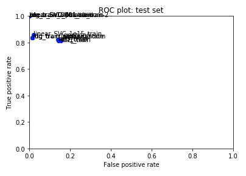
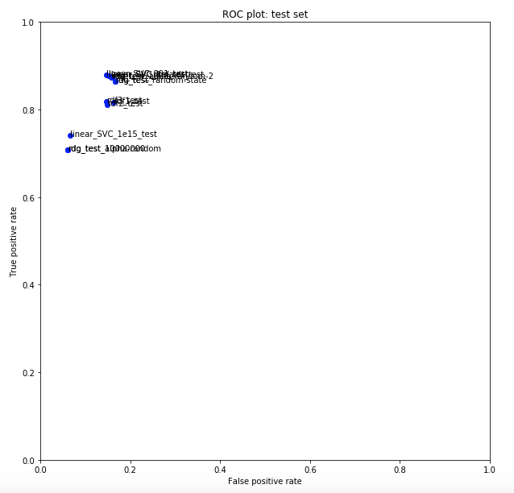

## Further model tuning and final model

This repository contains two notebooks - *model_tuning* with added features and several iterations of various classification models, and *final_model* with the final model for the classification task.

#### Changes Introduced in *model_tuning*:
* Remove HTML tags from text using regular expression

		movie_data['review'] = movie_data['review'].str.replace(r'<[^<>]*>', '', regex=True)	
 
* Iterations of the RidgeClassifier model
	* alpha=1000
	* alpha=10000000
	* solver='sag'
	* random_state=1000
	* random_state=1000, alpha=10000000
	* random_state=1000, alpha=1000
* Iterations of the Liner SVC model
	* C=1000000
	* C=0.001
	* C=1e-15

#### Changes Introduced in *model_tuning*:
* Remove HTML tags from text using regular expression

		movie_data['review'] = movie_data['review'].str.replace(r'<[^<>]*>', '', regex=True)
		
#### Changes Introduced in *final_model*:

* Lemmatize the reviews

		movie_data['lemmatized_reviews'] = movie_data.review.apply(lambda x: lemmatizer.lemmatize(x))
* Count number of sentences in each review
		
		movie_data['lemmatized_reviews'] = movie_data.review.apply(lambda x: lemmatizer.lemmatize(x))
		
* Count number of nouns, adjectives, adverbs, verbs, others, and 'to be' in each review using NLTK POS-tagging

* Iterations of the RidgeClassifier model
	* alpha=1000
	* alpha=10000000
	* solver='sag'
	* random_state=1000
	* random_state=1000, alpha=10000000
	* random_state=1000, alpha=1000
* Iterations of the Liner SVC model
	* C=1000000
	* C=0.001
	* C=1e-15
* Iterations of the Random Forest model
	* max\_depth=2, random\_state=0, n\_estimators=1000
	* max\_depth=2, random\_state=0, n\_estimators=3000
	* max\_depth=2, random\_state=0, n\_estimators=5000

 
	
Here are the ROC plots comparing the models and their iterations on the train and test set:

#### *model_tuning*:

###### ROC train set

###### ROC test set

 

#### *final_model*:

###### ROC train set

###### ROC test set

