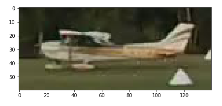
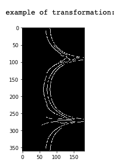
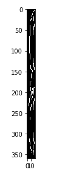
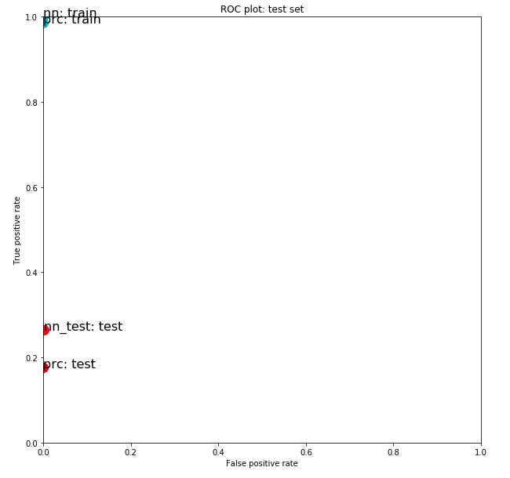
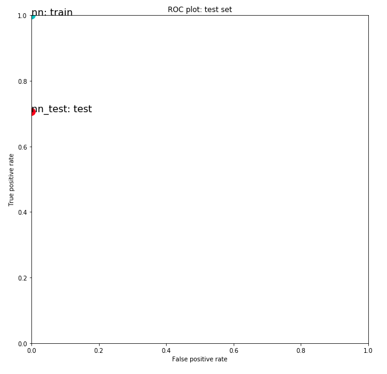

## Base Models

Task: *Fit various models and assess their performance on the train and test datasets. Then, introduce changes to show the effect of multiple alterations on the feature set for a neural network (Multi-layer Perceptron in scikit-learn)*

For the image transformation I used the scikit image transform.resize, transform.warp_polar, and feature.canny functions. The two notebooks show the performance of the Neural Network model using different dimensions - (360, 20) and (15, 35).
###### Original image

###### Transformed image - (360, 20)

###### Transformed image - (15, 35)

 

#### Changes introduced to *neural_network.MLPClassifier* parameters:
* max_iter=10000, solver='adam', activation='logistic'

Here is the ROC plot comparing the performance of of the model on train data and test data after the changes were introduced.

###### ROC train set - (360, 20)

###### ROC train set - (15, 35)

