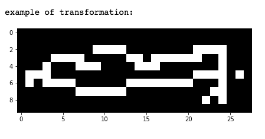

## Hidden Layer Sizes

Task: *Introduce changes to show the effect of multiple alterations on the hidden_layer_sizes parameter for a neural network.*

For the image transformation I used the scikit image transform.downscale_local_mean, and feature.canny functions and image dimensions (60, 140).
###### Original image

###### Transformed image

 

#### Changes introduced to *neural_network.MLPClassifier* parameters:
* max_iter=1000, activation='logistic'
* max_iter=1000, activation='logistic', hidden_layer_sizes=(4, 3, 2)
* max_iter=1000, activation='logistic', hidden_layer_sizes=(50,25,15)
* max_iter=1000, activation='logistic', hidden_layer_sizes=(6,5,4,3)
* max_iter=1000, activation='logistic', hidden_layer_sizes=(100, 80, 60, 40, 20)
* max_iter=1000, activation='logistic', hidden_layer_sizes=(200, )
* max_iter=1000, activation='logistic', hidden_layer_sizes=(32, 16, 4)
* max_iter=1000, activation='logistic', hidden_layer_sizes=(256, 256)

 

Here is the ROC plot comparing the performance of of the model on train data and test data after the changes were introduced.

###### ROC train set

 

Additionally, I plotted grouped bar charts comparing the models' accuracy and precision:

###### Accuracy - scale 0 to 1

###### Accuracy - scale 0.9 to 1

###### Precision - scale 0 to 1

###### Precision - scale 0.9 to 1
