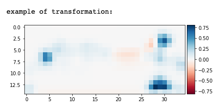
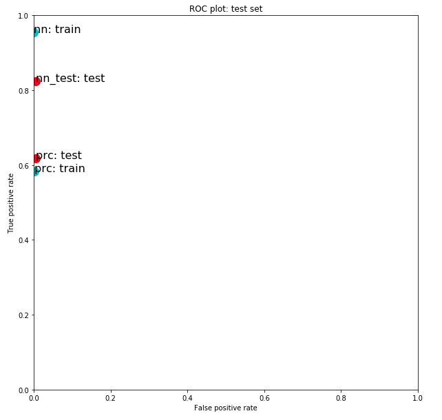

## Model Tuning

Task: *Introduce changes to the improve the performance of the neural network (Multi-layer Perceptron)*

For the image transformation I used the scikit image transform.rescale, and feature.corner_harris functions and image dimensions (15, 35). The Multi-layer Perceptron (neural network) uses default parameters, with the exception of max\_iter=5000.
###### Original image

###### Transformed image

 

Here is the ROC plot comparing the performance of of the model on train data and test data after the changes were introduced.

###### ROC train set
