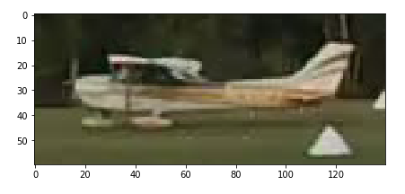
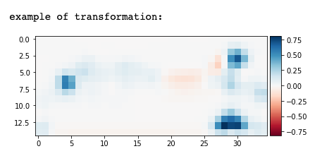
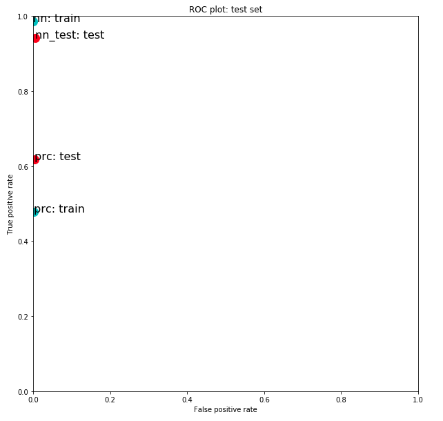
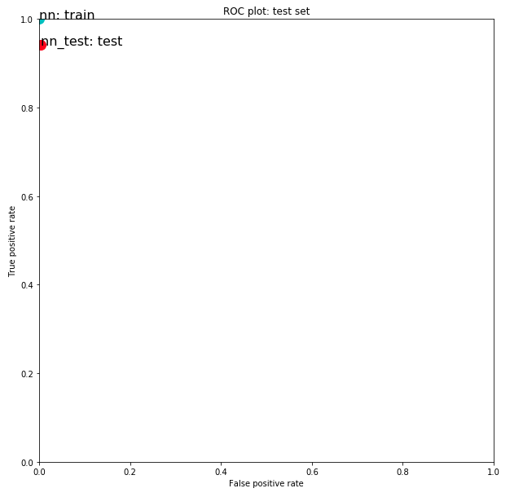

## Further model tuning and final model

For the image transformation I used the scikit image transform.rescale, and feature.corner_harris functions and image dimensions (15, 35).
###### Original image

###### Transformed image

 

#### Changes introduced to *neural_network.MLPClassifier* parameters:
* max_iter=10000, alpha=1e-125, hidden_layer_sizes=(100, 100, 50, 50, 25, 25), solver='adam', learning_rate='invscaling'

 

Here is the ROC plot comparing the performance of the model on train data and test data after the changes were introduced.

###### ROC - Iteration04

###### ROC - final_iteration
