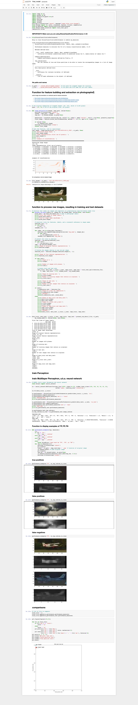

### 02 - Classification, image recognition

*Classification Task: Flying Dollar Airport is a small, public-use airport in the Poconos with a 2,400 foot turf runway. A Nest Cam is pointed at a 200 foot section in the middle of the runway. When the Nest Cam detects activity, a static image is captured. “Activity” is any significant movement in the frame. This includes aircraft arrivals and departures, but also includes many other things such as cloud movement, animals, rain, snow, trees moving in the wind, people, vehicles, the movement of light, and other motion. Of the 6,758 images, only 101 contain aircraft. Train a model to best predict plane, the boolean indicator that indicates the presence of an aircraft in an image.*

This repository consists of four tasks performed in tuning the models: exploring base models, augmenting the hidden\_layer\_sizes of neural network, further tuning of neural network, and the final version of the model.

###### Final code
