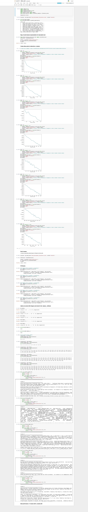

### 03 - Unsupervised learning, clustering using K-means

*Clustering task: Use an unsupervised learning method to cluster incident descriptions into broader categories.*

The two notebooks show two approaches in deciding the number of clusters used by the K-means model - Silhouette analysis and Elbow plots.

###### Elbow plot analysis
